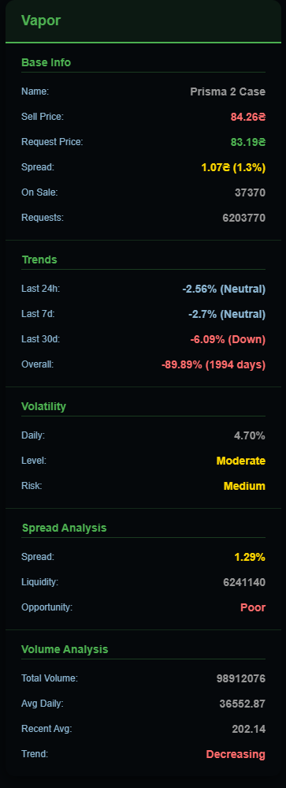
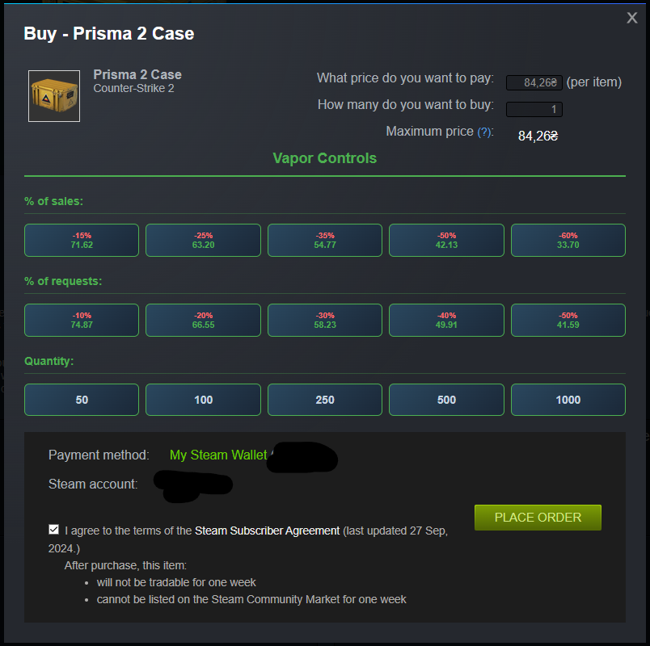

# Vapor - Steam Market Helper Extension

A powerful Chrome extension designed to enhance your Steam Community Market experience with advanced analytics, quick price controls, and automated features.

## ✨ Features

### 📊 Market Analytics
- **Real-time Price Analysis**: Get instant insights into market trends, volatility, and price movements
- **Spread Analysis**: View bid-ask spreads and liquidity metrics
- **Volume Tracking**: Monitor trading volume and recent activity
- **Trend Detection**: Identify bullish, bearish, and neutral market trends across different timeframes

### ⚡ Quick Controls
- **Smart Price Setting**: Set buy orders with percentage-based discounts from current sell/request prices
- **Quantity Shortcuts**: One-click quantity selection (50, 100, 250, 500, 1000)
- **Auto-Checkbox**: Automatically accept Steam Subscriber Agreement

### 🎯 Trading Insights
- **Volatility Assessment**: Risk level indicators from very low to extreme
- **Trading Recommendations**: AI-powered suggestions for buying, selling, or holding
- **Opportunity Analysis**: Evaluate trading potential (Poor to Excellent ratings)
- **Historical Data**: View price trends over 24h, 7d, and 30d periods

## 🚀 Installation

### Manual Installation (Current)
1. Download the extension files from this repository
2. Open Chrome and navigate to `chrome://extensions/`
3. Enable "Developer mode" in the top right
4. Click "Load unpacked" and select the extension folder
5. The extension will be installed and ready to use

### Microsoft Edge Add-ons, Opera Add-ons (Coming Soon)
The extension will be available on the Microsoft Edge Add-ons, Opera Add-ons in the near future.

## 💡 How to Use

1. **Navigate** to any Steam Community Market item page
2. **View Analytics**: The Vapor info panel will automatically appear in the bottom-right corner
3. **Quick Trading**: When placing buy orders, use the Vapor Controls panel for quick price and quantity selection
4. **Monitor Trends**: Check the analytics section for market insights and trading recommendations

## ⚙️ Technical Details

- **No Additional API Calls**: Works entirely with existing Steam page data - no new requests to Steam API
- **Real-time Processing**: Analyzes market data as you browse
- **Lightweight**: Minimal performance impact on your browsing experience
- **Secure**: All processing happens locally in your browser

## 🔧 Supported Pages

- Steam Community Market item listings (`steamcommunity.com/market/listings/*`)
- Buy order dialogs and market interfaces

## 📝 Permissions

The extension requires minimal permissions:
- `activeTab`: Access to the current Steam Market tab
- `host_permissions`: Access to Steam Community Market pages only

## 🐛 Issues & Feedback

If you encounter any issues or have suggestions for improvement:

- **GitHub Issues**: [Create an issue](../../issues) on this repository
- **Discord**: Contact me directly at `@StarLith`

## 🔄 Updates

The extension is actively maintained and regularly updated with new features and improvements.

## 📄 License

This project is licensed under the GNU GENERAL PUBLIC LICENSE V3 - see the [LICENSE](LICENSE) file for details.

## ⚠️ Disclaimer

This extension is not affiliated with or endorsed by Valve Corporation or Steam. Use at your own discretion and always follow Steam's Terms of Service.

---

**Made with ❤️ for the Steam trading community**